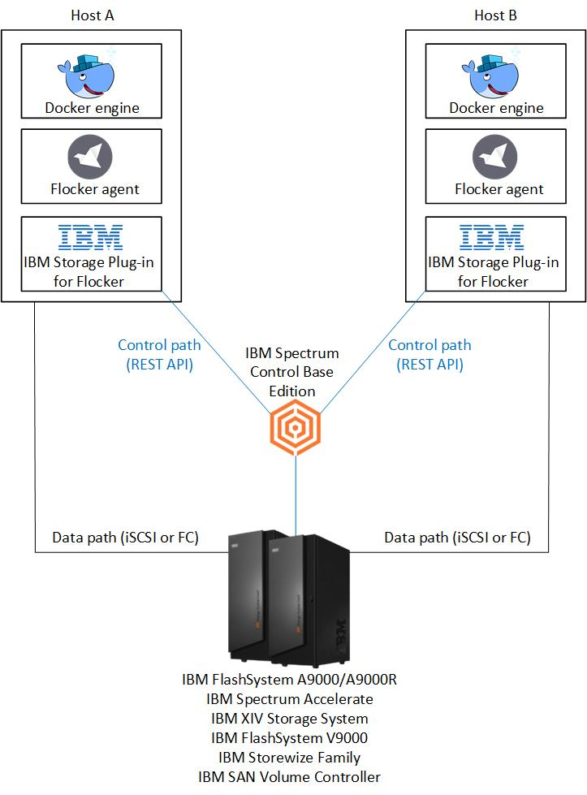

IBM Storage Plug-in for Flocker
======================
This block storage plug-in (driver) for Flocker enables IBM storage systems to be used for persistent Docker containers.
The plug-in is provided as is. It is an experimental feature that can be used in development and testing environments.
The driver is certified for Flocker 1.15.0, Docker 12, RHEL 7.2 and IBM Spectrum Control Base Edition (SCBE) 3.2.0, supporting the following storage systems :
- IBM Spectrum Accelerate Family products:
   - FlashSystem A9000/A9000R
   - Spectrum Accelerate
   - XIV
- IBM FlashSystem V9000

## IBM Storage Plug-in for Flocker diagram


## Overview

Flocker is an open-source container data volume manager for your dockerized applications.
Typically, Docker data volumes are tied to a single server. However, when Flocker datasets are used, the data volume can move with a container between different hosts in your cluster. This flexibility allows stateful container services to access data no matter where the container is placed.

## Prerequisites
The following components are required before using the plug-in:

1. Install Flocker.
2. Install and configure IBM Spectrum Control Base Edition.
3. Configure storage connectivity and multipathing.

**1. Install Flocker**

See the instructions on how to install Flocker on your nodes at [Flocker](https://flocker.readthedocs.io/en/latest/).

**2. Installing and configuring IBM Spectrum Control Base Edition**

The IBM Storage plug-in for Flocker communicates with the IBM storage systems through IBM Spectrum Control Base Edition 3.2.0 or later.
See [IBM Knowledge Center](http://www.ibm.com/support/knowledgecenter/STWMS9/landing/IBM_Spectrum_Control_Base_Edition_welcome_page.html) for instructions on how download, install and configure Spectrum Control Base Edition software.

After IBM Spectrum Control Base Edition is installed, do the following :
* Log into Spectrum Control Base Edition server at https://SCBE_IP_address:8440.
* Add a Flocker interface. Note: The Flocker interface username and the password will be used later, when creating and editing the agent.yml file.
* Add the IBM storage systems to be used with the Flocker plug-in.
* Create storage service(s) with required storage capacities and capabilities.
* Delegate at least one storage service to the Flocker interface.

**3. Configuring storage connectivity and multipathing**

The plug-in supports FC or iSCSI connectivity to the storage systems.
- Install OpeniSCSI and SCSI utilities.
    * Ubuntu
   ```bash
    sudo apt-get update
    sudo apt-get -y install scsitools
    sudo apt-get install -y open-iscsi  # only if you need iSCSI
    ```
    * Redhat
    ```bash
    sudo yum -y install sg3_utils
    sudo yum -y install iscsi-initiator-utils  # only if you need iSCSI
    ```

- Install and configure multipathing.
    * Ubuntu
   ```bash
    sudo apt-get multipath-tools
    cp multipath.conf /etc/multipath.conf
    multipath -l  # Check no errors appear.
   ```

    * Redhat
   ```bash
    yum install device-mapper-multipath
    sudo modprobe dm-multipath

    cp multipath.conf /etc/multipath.conf  # Default file can be copied from  /usr/share/doc/device-mapper-multipath-*/multipath.conf to /etc
    systemctl start multipathd
    systemctl status multipathd  # Make sure its active
    multipath -ll  # Make sure no error appear.
   ```

- Verify that the hostname of the Flocker node or the hostname configured in the agent.yml file is defined on the relevant storage systems with the valid WWPNs or IQN of the node.

- For iSCSI - Discover and login to the iSCSI targets of the relevant storage systems:
    * Discover iSCSI targets of the storage systems portal on the host
    
       ```bash
          iscsiadm -m discoverydb -t st -p ${Storage System iSCSI Portal IP}:3260 --discover
       ```
    * Log in to iSCSI ports. You must define at least two iSCSI ports per storage system to achieve multipathing.
    
       ```bash
          iscsiadm -m node  -p ${storage system iSCSI portal IP/hostname} --login
       ```

## Installation
Install IBM Storage Plug-in for Flocker on each node of the Flocker cluster.

```bash
   sudo /opt/flocker/bin/pip install git+https://github.com/ibm/flocker-driver/
```

## Usage instructions
Create and edit the agent.yml file in /etc/flocker directory as follows:
```bash
version: 1
control-service:
   hostname: "FLOCKER_CONTROL_NODE"
dataset:
  backend: "ibm_storage_flocker_driver"
  management_ip: "SCBE IP"
  management_port: "SCBE PORT"
  verify_ssl_certificate: "Boolean"
  username: "USERNAME"
  password: "PASSWORD"
  default_service: "SERVICE"
  hostname: "HOSTNAME"
  log_level: "LEVEL"
```
Replace the following values, according your environment:
- **FLOCKER_CONTROL_NODE** = hostname or IP of the Flocker control node
- **SCBE_IP** = SCBE server IP or FQDN 
- **SCBE_PORT** = SCBE server port. This setting is optional (default port is 8440).
- **Boolean** = True verifies SCB SSL certificate or False ignores the certificate (default is True)
- **USERNAME** = user name defined for SCBE Flocker interface
- **PASSWORD** = password defined for SCBE Flocker interface
- **SERVICE** = SCBE storage service to be used by default as the Flocker default profile
- **HOSTNAME** = The host defined on the storage system. This setting is optional (default is Flocker node hostname).
- **LEVEL** = Log level for the plug-in. This setting is optional (default is INFO). For debugging, use DEBUG. 

## Running tests
- To verify the plug-in installation, set up the configuration file, as explained below. Change the values according to your environment.
    ```bash
    export IBM_STORAGE_CONFIG_FILE=/etc/flocker/ibm.yml

    vi $IBM_STORAGE_CONFIG_FILE
    ibm:
      management_ip: "SCBE IP"
      management_port: "SCBE PORT"
      verify_ssl_certificate: "Boolean"
      username: "USERNAME"
      password: "PASSWORD"
      default_service: "SERVICE"
      hostname: "HOSTNAME"
      log_level: "LEVEL"
    ```

- Run the tests
    ```bash
    sudo /opt/flocker/bin/trial  test_ibm_storage_flocker_driver
    ```


## Contribution
Create a fork of the project into your own repository. Make all necessary changes, create a pull request with a description on what was added or removed, provide details on code changes. If the changes are approved, project owners will merge it.

Licensing
---------

Copyright 2016 IBM Corp.

Licensed under the Apache License, Version 2.0 (the "License");
you may not use this file except in compliance with the License.
You may obtain a copy of the License at

http://www.apache.org/licenses/LICENSE-2.0

Unless required by applicable law or agreed to in writing, software
distributed under the License is distributed on an "AS IS" BASIS,
WITHOUT WARRANTIES OR CONDITIONS OF ANY KIND, either express or implied.
See the License for the specific language governing permissions and
limitations under the License.
